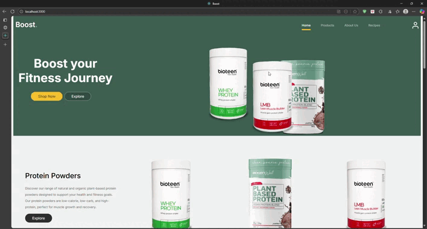

# React and WCF Service Application - A 3 tier e-commerce platform

## Description
### What is it:
This project is a website called Quick Kart.
Quick Kart is an online grocery shopping platform that simplifies meal 
planning and grocery shopping for users. In addition to the standard online 
grocery shopping features, Quick Kart allows users to select from a curated list 
of recipes. Upon selecting a recipe, the system automatically adds all necessary 
ingredients to the user's shopping cart. This feature saves time, reduces food 
waste, and enhances the user experience by making meal planning and grocery 
shopping seamless and efficient.

### Why was it built:
This was a project built in order to learn more about how a 3-tier system works. 
This project was to learn web technologies using React as well as what does into 
building an backend to do all the processes.
This was built for a group project for a University module to learn how to collaborate
with team members to develop a 3-tier system.

## Screenshots

### Customer View

#### - Homepage

#### - Login

#### - Product Listing Page

#### - Product Description Page

#### - Shopping Cart and Invoice

### Manager View
Manager uses the same Login page as the Customer.
Manager Details:
**Email: JDoe@gmail.com**
**Password: Password**

#### - Manager Dashboard

#### - Manager Registration

#### - Product Stock

#### - Add Product Page

#### - Edit Product Page

#### - Add Recipe Page

#### - Edit Recipe Page

## Features List:
1. Online Gorcery Shopping
    - Browse and purchase groceries through a user-friendly web interface.
2. Curated Recipe Selection
    - Exploer a collection of handpicked recipes for meal inspiration.
3. One-Click Ingredient Add
    - Automatically add all required ingredients from a selected recipe directly to your cart.
4. Time-Saving Shopping 
    - Streamlined process for adding multiple items at once, reducing browsing time.
5. Food Waste Reduction 
    - Helps prevent over-purchasing by adding only the needed quantities of ingredients.
  
## Technologies used:
**Frontend:** React.js, CSS, JavaScript
**BackEnd:** WCF Service Application, C#
**Databse:** SQL, WCF Service
**Version Control:** GitHub, GitHub

## Installation and Setup instructions:

### Running the Back-end:
1. Navigate into the Back_End folder
2. Open Back_End.sln file with Visual Studio (This was created using Visual Studio 2019)
3. Run the project using F5 (Make sure you have one of the .cs files open)
4. A broswer window should open. Congratulations, the BackEnd is running!

### Running the Front-end:
1. Navigate to Front_End >> informaticsproject
2. Open the folder in Visual Studio Code
3. Open the terminal in Visual Sudio Code
4. Run *npm install*
5. Run *npm start*

## Credits:

### Development Team:
  - Teboho Majake
  - Thama Mabatha
  - Karen Mandishona
  - Thapelo Bonoko
  
### Website Template:
  